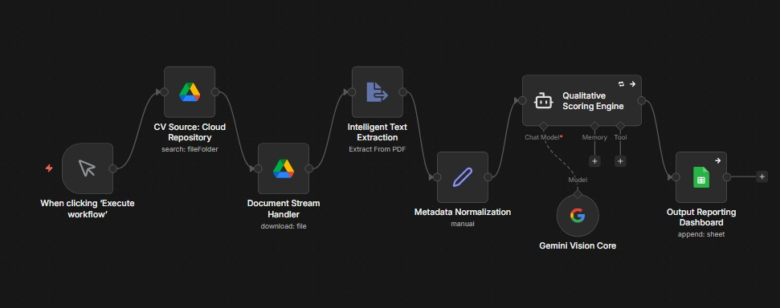

# AI-Recruitment-Automation-Pipeline
Automated CV screening and scoring system using n8n and Gemini 2.5 Pro for unbiased talent acquisition.
# AI-Powered Talent Screening Pipeline (v1.0)

Proyek ini adalah sebuah **Proof of Concept (PoC)** sistem otomatisasi proses rekrutmen berskala besar (Mass Hiring) menggunakan **n8n** sebagai orchestrator utama dan **Gemini 2.5 Pro** sebagai *Intelligent Qualitative Scoring Engine*. 

Sistem ini dirancang untuk mereduksi waktu screening CV hingga **93%**, menekan biaya operasional hingga **99.7%**, serta menjamin proses seleksi yang **100% objektif, transparan, dan bebas dari bias manusia**.

---

## 🚀 Arsitektur Sistem (Workflow Nodes)
Alur data berjalan secara *end-to-end* dari hulu ke hilir dengan urutan sebagai berikut:
1. **Execute Workflow** (Manual/Webhook trigger)
2. **CV Source: Cloud Repository** (Mendeteksi file masuk di Google Drive)
3. **Document Stream Handler** (Mengunduh file PDF kandidat)
4. **Intelligent Text Extraction** (Mengekstrak teks mentah dari PDF)
5. **Metadata Normalization** (Menyaring & membersihkan struktur data teks)
6. **Gemini Vision Core (Gemini 2.5 Pro)** (Proses kognitif analisis kualifikasi)
7. **Qualitative Scoring Engine** (Pemetaan data ke format JSON terstruktur)
8. **Output Reporting Dashboard** (Penyimpanan data akhir ke Google Sheets secara real-time)

---

## 🔒 Privasi Data & Anti-Bias (Nilai Jual Utama)
Untuk memastikan kepatuhan terhadap objektivitas rekrutmen, sistem ini dikonfigurasi secara ketat pada node *Metadata Normalization* dan prompt LLM untuk **mengabaikan informasi personal** kandidat seperti:
- Nama Lengkap
- Umur & Tanggal Lahir
- Jenis Kelamin (Gender)
- Lokasi Geografis / Alamat

AI murni melakukan evaluasi berbasis **Kompetensi Teknis**, kesesuaian **Pendidikan Formal**, penguasaan **Software Required**, dan relevansi **Pengalaman Kerja**.

---

## 🛠️ Cara Menggunakan (Setup & Deployment)

### Prasyarat
- Akun [n8n](https://n8n.io/) (Self-hosted atau Cloud)
- Google Cloud Console Account (Untuk akses Google Drive & Google Sheets API)
- Google AI Studio API Key (Menggunakan model `Gemini 2.5 Pro`)

### Langkah Instalan
1. Clone repository ini atau unduh file `workflow.json`.
2. Masuk ke dashboard n8n Anda.
3. Buat workflow baru, klik menu di pojok kanan atas, lalu pilih **Import from File**.
4. Pilih file `workflow.json` yang telah diunduh.
5. Konfigurasikan *Credentials* untuk Google Drive, Google Sheets, dan Gemini API Key Anda.
6. Sistem siap dijalankan secara otomatis (*Set and Forget*).

---

## 📊 Analisis Efisiensi Biaya (Cost Scaling)
Berdasarkan metrik kalkulasi token pada tier *Pay-as-you-go* menggunakan **Gemini 2.5 Pro**, biaya operasional sistem ini sangat efisien:
- **Estimasi Biaya per 1 CV:** ~Rp 26,-
- **Estimasi Biaya per 1.000 CV:** ~Rp 26.400,-
- **Dampak Bisnis:** Menghemat puluhan jam kerja HRD per minggu dan memotong *labor cost* screening awal hingga hampir 100%.

---
**Dirancang dan Dikembangkan oleh:** *Muhammad Andithya Mirza Yaldi*
